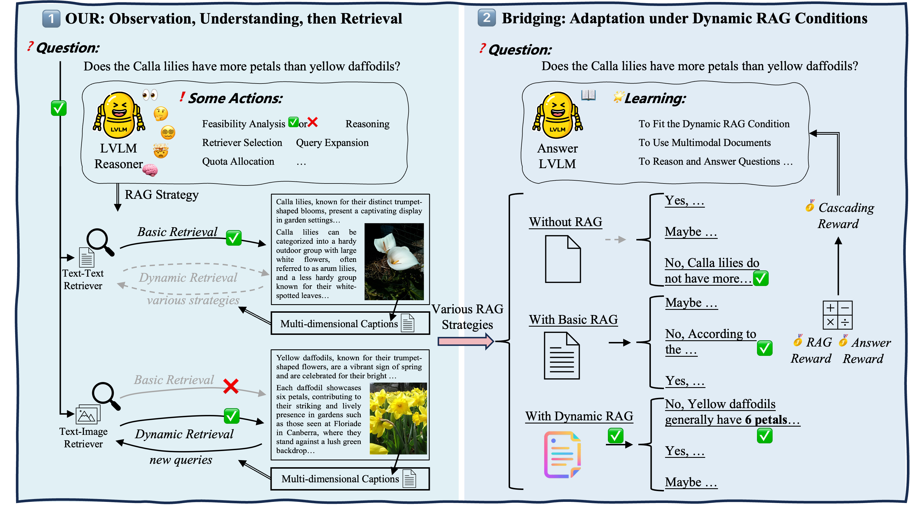

# OURMRAG: Observation, Understanding, then Retrieval, Dynamic Multimodal RAG via LLM Reasoning

## Introduction

Welcome to OURMRAG, a dynamic multimodal RAG framework that enables adaptive retrieval planning and answer alignment. The strategy planning module \textbf{OUR} supports both text–text and text–image retrieval. It incorporates a multi-dimensional captioning component to enhance visual reasoning and leverages a large vision-language model (LVLM) to reason and perform key actions and determine suitable RAG strategies. To align answer generation with dynamic MRAG conditions, we introduce a bridging module trained with a cascading reward function that jointly considers retrieval relevance and answer quality.

  

